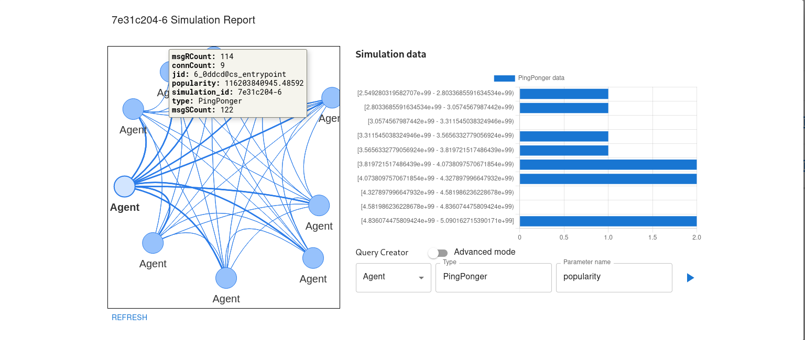

# Local Interface

## Table of Contents

- [About](#about)
- [Getting Started](#getting_started)
- [Usage](#usage)
- [Structure](#structure)
- [Contributing](#contributing)

## About <a name = "about"></a>

Local Interface for simulation definition, management and analysis.
Local Interface is apart of the [Agents Assembly](https://agents-assembly.com) ecosystem.
Other applications are:
- [Simulation Run Environment](https://github.com/agent-base-information-flow-simulation/simulation-run-environment) - scalable run environment for Agents Assembly.
- [Communication Server](https://github.com/agent-based-information-flow-simulation/communication-server) - cluster of servers used for XMPP communication.
- [Agents Assembly Translator](https://github.com/agent-based-information-flow-simulation/agents-assembly-translator) - translator for Agents Assembly code.



## Getting Started <a name = "getting_started"></a>

### Prerequisites

```
docker
docker-compose (dev only)
```

### Installing
To use the application, utilize the `server.sh` script. </br>
First, initialize the cluster:
```
./server.sh init
```

Alternatively, join the existing cluster using the `TOKEN` received from the `init` command:
```
./server.sh join TOKEN
```

Then, create the required networks (this step needs to be done only once inside the cluster):
```
./server.sh network
```

Finally, start the application:
```
./server.sh start
```
After starting, the application is available at http://localhost:80.

To see all the available options run the `help` command:
```
./server.sh help
```

## Usage <a name = "usage"></a>
The application must be used with the dedicated simulation run environment, described in [About](#about)

## Structure <a name = "structure"></a>
The structure of the local interface is presented below.
- [User interface](#db)
- [Proxy](#db-gui)

### User interface
React.js app used as GUI. It handles user interaction with the system.

Environment variables:
* `CHOKIDAR_USEPOLLING` - reload application after detecting a change in source files (i.e., true); if set to true, it requires the following volume attached: user-interface/src:/app/src
* `PORT` - listen port (must be 80)

### Proxy
Nginx instance that provides a gateway to the Simulation Run Environment.

Host port mapping:
* port `80` - access to user interface and simulation run environment API (`/api`)

Host port mapping (dev only):
* port `8008` - simulation run environment database connection (neo4j)

## Contributing <a name = "contributing"></a>
Please follow the [contributing guide](CONTRIBUTING.md) if you wish to contribute to the project.
