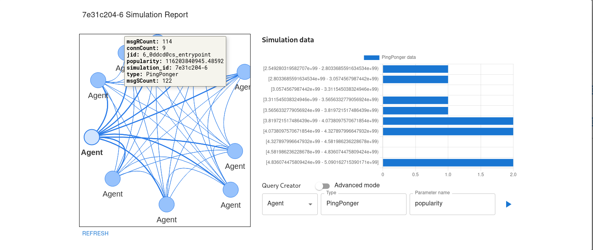

# Local Interface

## Table of Contents

- [About](#about)
- [Getting Started](#getting_started)
- [Usage](#usage)
- [Services](#services)
- [Contributing](#contributing)

## About <a name = "about"></a>

Local Interface for simulation definition, management and analysis.
Local Interface is apart of the [Agents Assembly](https://agents-assembly.com) ecosystem.
Other applications are:
- [Simulation Run Environment](https://github.com/agent-base-information-flow-simulation/simulation-run-environment) - scalable run environment for Agents Assembly.
- [Communication Server](https://github.com/agent-based-information-flow-simulation/communication-server) - cluster of servers used for XMPP communication.
- [Agents Assembly Translator](https://github.com/agent-based-information-flow-simulation/agents-assembly-translator) - translator for Agents Assembly code.



## Getting Started <a name = "getting_started"></a>

### Prerequisites

```
docker
docker-compose
```

### Installing
Use the `server.sh` utility script.
```
./server.sh help
```

## Usage <a name = "usage"></a>
The application must be used with a dedicated simulation run environment, described in [About](#about)

After starting the `.dev.swarm.yml` compose file, the server in accessible on localhost. </br>
Host port mapping: </br>
* port `80` - simulation run environment entrypoint (api)
* port `8008` - simulation run environment entrypoint (neo4j)

## Services <a name = "services"></a>
### User Interface
React.js app used as GUI. It handles all user interaction with the system, once running.

Environment variable:
* `PORT` - 
### Proxy
Nginx instance providing a gateway to the Simulation Run Environment.

## Contributing <a name = "contributing"></a>
Please follow the [contributing guide](CONTRIBUTING.md) if you wish to contribute to the project.
